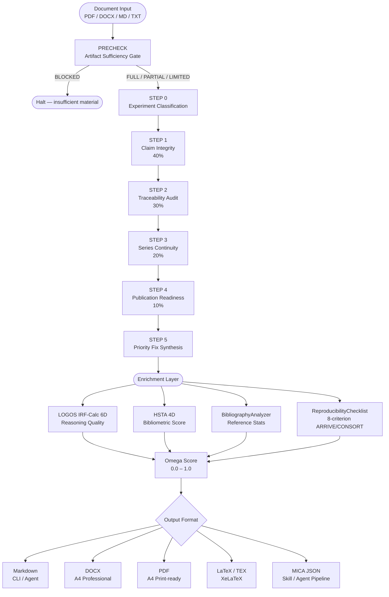

# VERITAS v2.2.1
## AI Critique Experimental Report Analysis Framework

[](https://github.com/flamehaven01/Flamehaven-Veritas/actions/workflows/ci.yml)
[](https://github.com/flamehaven01/Flamehaven-Veritas/actions/workflows/release.yml)
[](https://pypi.org/project/flamehaven-veritas/)
[](https://www.python.org/downloads/)
[](LICENSE)
[](#development)
[](#development)
[](#spar-integration)

A **sovereignty-grade** experimental report critique engine.  
Implements the **VERITAS v2.2 protocol** as a fully executable Python package + REST API + CLI.

---

## What It Does

Accepts a raw experimental report (text, PDF, DOCX, MD) and produces a structured critique through a
7-phase pipeline, enriched with LOGOS reasoning, HSTA scoring, bibliography analysis, and
reproducibility assessment.

| Phase | Name | Weight |
|---|---|---|
| PRECHECK | Artifact Sufficiency Gate | — |
| STEP 0 | Experiment Classification | — |
| STEP 1 | Claim Integrity | 40% |
| STEP 2 | Traceability Audit | 30% |
| STEP 3 | Series Continuity | 20% |
| STEP 4 | Publication Readiness | 10% |
| STEP 5 | Priority Fix Synthesis | — |

**Output enrichment layers:**

| Engine | Output | Description |
|---|---|---|
| LOGOS IRF-Calc 6D | `irf_scores` | M/A/D/I/F/P reasoning quality dimensions |
| BioMedical-Paper-Harvester HSTA | `hsta_scores` | N/C/T/R bibliometric quality |
| BibliographyAnalyzer | `bibliography_stats` | Reference count, formats, year range, quality score |
| ReproducibilityChecklistExtractor | `reproducibility_checklist` | 8-criterion ARRIVE/CONSORT assessment |

---

## Workflow



---

## Quick Start

```bash
pip install flamehaven-veritas
```

### Python API

```python
from veritas import SciExpCritiqueEngine

engine = SciExpCritiqueEngine()
report = engine.critique(report_text)

print(report.precheck.line1)                    # PRECHECK MODE: FULL
print(report.omega_score)                       # 0.8571
print(report.irf_scores.composite)             # LOGOS IRF composite
print(report.bibliography_stats.quality_score) # 0.74
```

### CLI

```bash
# Critique from file (output to terminal as Markdown)
veritas critique path/to/report.pdf

# Critique and save formatted report
veritas critique report.pdf --format docx --output report_critique.docx
veritas critique report.pdf --format pdf  --output report_critique.pdf
veritas critique report.pdf --format tex  --output report_critique.tex
veritas critique report.pdf --format md   --output report_critique.md

# Use KU Research Report template
veritas critique report.pdf --template ku --format docx

# Run PRECHECK gate only
veritas precheck report.pdf

# MICA Playbook mode — structured JSON for agent/skill pipelines
veritas critique report.pdf --mica
```

### REST API

```bash
# Start the server
uvicorn veritas.api.app:app --reload --port 8400

# Submit text
curl -X POST http://localhost:8400/api/v1/critique/text \
  -H "Content-Type: application/json" \
  -d '{"report_text": "...", "template": "bmj", "round_number": 1}'

# Upload a document
curl -X POST http://localhost:8400/api/v1/critique/upload \
  -F "file=@report.pdf" -F "template=bmj"

# Download formatted report
curl -X POST http://localhost:8400/api/v1/critique/download \
  -F "file=@report.pdf" -F "format=docx" -o critique.docx
```

---

## Output Formats

| Format | Flag | Description |
|---|---|---|
| Markdown | `--format md` | Structured `.md` with tables (low token cost) |
| DOCX | `--format docx` | A4 professional report (python-docx) |
| PDF | `--format pdf` | A4 print-ready (ReportLab) |
| LaTeX | `--format tex` | Standalone `.tex` (XeLaTeX-compatible, optional `compile_pdf`) |

All outputs use either the **BMJ Scientific Editing** template or the
**KU Research Report** template (`--template bmj|ku`).

---

## API Endpoints

| Method | Path | Description |
|---|---|---|
| `POST` | `/api/v1/critique/text` | Full critique pipeline (JSON body) |
| `POST` | `/api/v1/critique/upload` | Full critique pipeline (file upload) |
| `POST` | `/api/v1/critique/download` | Upload file, receive formatted report |
| `POST` | `/api/v1/precheck` | PRECHECK gate only |
| `POST` | `/api/v1/classify` | STEP 0 classification only |
| `GET`  | `/health` | Liveness check |
| `GET`  | `/version` | Package version |

See [docs/api_reference.md](docs/api_reference.md) for full schema.

---

## Enrichment Engines

### LOGOS IRF-Calc 6D

Six-dimensional reasoning quality score computed over the critique text:

| Dimension | Key | Meaning |
|---|---|---|
| Methodic Doubt | M | Systematic uncertainty articulation |
| Axiom / Hypothesis | A | Central claim falsifiability |
| Deduction | D | Logical step validity |
| Induction | I | Evidence generalization quality |
| Falsification | F | Testability and counter-evidence exposure |
| Paradigm | P | Framework consistency |
| **Composite** | — | Mean of M+A+D+I+F+P; threshold ≥ 0.78 = PASS |

### HSTA 4D (BioMedical-Paper-Harvester)

Four-dimensional bibliometric score:

| Dimension | Key | Meaning |
|---|---|---|
| Novelty | N | Unique technical term density |
| Consistency | C | Contradiction marker absence |
| Temporality | T | Version / date marker presence |
| Reproducibility | R | Method detail completeness |
| **Composite** | — | Arithmetic mean (N+C+T+R)/4 |

### Bibliography Analysis

Extracted automatically from the reference section of the submitted document:

- Total reference count and format detection (Vancouver / APA / Harvard)
- Year range (oldest → newest)
- Self-citation detection
- Quality score: 0.0–1.0 composite (recency 50% + breadth 50%, −10% if self-cites detected)

### Reproducibility Checklist

8-criterion assessment derived from ARRIVE 2.0 / CONSORT 2010 / STROBE / TOP Guidelines:

| Code | Criterion |
|---|---|
| DATA | Open data availability statement |
| CODE | Code / software availability |
| PREREG | Pre-registration declaration |
| POWER | Statistical power / sample size justification |
| STATS | Statistics description (test, software, version) |
| BLIND | Blinding / randomization procedure |
| EXCL | Exclusion criteria stated |
| CONF | Conflict of interest declaration |

---

## PRECHECK Modes

```
FULL     — All artifacts present. Execute STEP 0 through STEP 5 normally.
PARTIAL  — Primary claim evaluable; secondary artifacts missing. Proceed, mark gaps.
LIMITED  — Primary claim partially evaluable. Constrained execution.
BLOCKED  — Insufficient material. Critique halted after PRECHECK.
```

---

## Traceability Classes

The engine uses exactly three traceability terms (no weaker substitutes):

| Class | Meaning |
|---|---|
| `traceable` | Fully anchored to a measured artifact |
| `partially traceable` | Some anchoring present; incomplete |
| `not traceable` | No artifact anchor found |

---

## Evidence Precedence

Conflicting artifacts are resolved by rank:

1. Measured artifact / raw result file
2. Hash manifest / trace log / deviation log
3. Inline figure or table
4. Narrative interpretation
5. Cross-cycle comparison prose

---

## MICA Playbook Mode

The CLI supports **MICA** (Memory Invocation & Context Archive) structured output for
agent / skill pipeline integration:

```bash
veritas critique report.pdf --mica
```

Returns a machine-readable JSON payload suitable for direct consumption by AI agents,
orchestrators, or downstream skills — without token overhead of formatted prose.

Load the full playbook at session start:

```bash
veritas playbook   # prints memory/playbook.md to stdout
```

---

## Development

```bash
git clone https://github.com/flamehaven01/Flamehaven-Veritas.git
cd Flamehaven-Veritas
pip install -e ".[dev]"

pytest                          # full suite + 80% coverage gate
ruff check src tests            # lint
mypy src                        # type check
```

---

## CI/CD Pipeline


---

## Architecture

See [docs/architecture.md](docs/architecture.md).

---

## Roadmap

| Version | Target | Features |
|---|---|---|
| **v2.2** ✅ | 2026 Q2 | LOGOS IRF-6D, HSTA 4D, BibliographyAnalyzer, ReproducibilityChecklist, LaTeX output, MICA Playbook |
| **v2.2.1** ✅ | 2026 Q2 | SPAR framework optional import fallback, CI green (159 tests, mypy 0 errors), version string fix |
| **v2.3** | 2026 Q3 | Multi-round iterative critique (`--round N`), diff-mode between rounds, delta Omega tracking |
| **v2.4** | 2026 Q3 | Batch processing (`veritas batch *.pdf`), parallel engine execution, JSON summary index |
| **v2.5** | 2026 Q4 | MICA v0.3 — persistent session memory across critique rounds, agent chain protocol |
| **v3.0** | 2027 Q1 | Full RAG integration (Flamehaven-Filesearch), domain-specific vocabulary models, auto-template selection |
| **v3.1** | 2027 Q2 | Web UI (React frontend), drag-and-drop upload, side-by-side diff view |
| **v3.2** | 2027 Q3 | Peer-review simulation mode — multi-reviewer consensus scoring |

---

## Acknowledgements

VERITAS is built on top of the **Flamehaven Sovereign Stack** and draws from the following
open research frameworks:

| Component | Reference |
|---|---|
| **BMJ Scientific Editing Report** | BMJ Author Services — Medical Scientific Editing Report template |
| **KU Research Report Template** | University of Kuala Lumpur — Research Report Writing Template |
| **ARRIVE 2.0** | Percie du Sert et al. (2020) — Animal Research: Reporting of In Vivo Experiments |
| **CONSORT 2010** | Schulz et al. (2010) — Consolidated Standards of Reporting Trials |
| **STROBE** | von Elm et al. (2007) — Strengthening the Reporting of Observational Studies in Epidemiology |
| **TOP Guidelines** | Nosek et al. (2015) — Transparency and Openness Promotion Guidelines |
| **IRF-Calc 6D** | Flamehaven LOGOS Engine — internal reasoning quality metric |
| **HSTA 4D** | Flamehaven BioMedical-Paper-Harvester — bibliometric scoring framework |
| **MICA v0.2.3** | Flamehaven MICA — Memory Invocation & Context Archive for AI agents |

---

## License

MIT © 2026 Flamehaven
