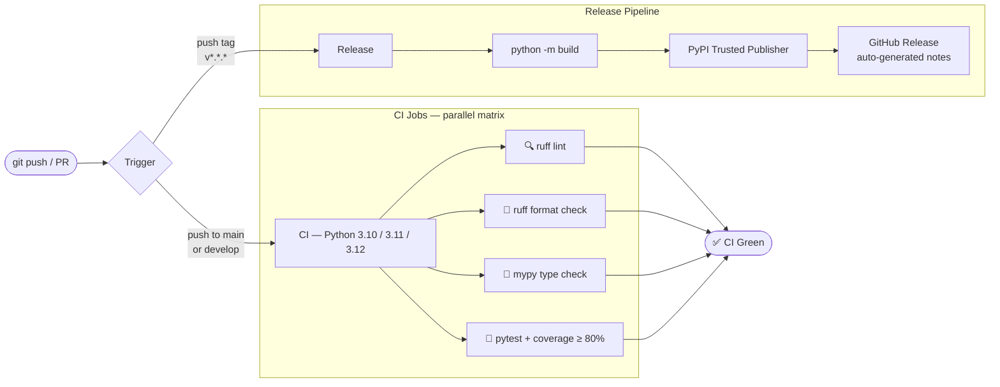

# VERITAS v3.4.0
## AI Critique Experimental Report Analysis Framework

[](https://github.com/flamehaven01/Flamehaven-Veritas/actions/workflows/ci.yml)
[](https://github.com/flamehaven01/Flamehaven-Veritas/actions/workflows/release.yml)
[](https://pypi.org/project/flamehaven-veritas/)
[](https://www.python.org/downloads/)
[](LICENSE)
[](#development)
[](#development)
[](#spar-integration)
[](#quality)

A **sovereignty-grade** experimental report critique engine.  
Implements the **VERITAS v3.3 protocol** as a fully executable Python package + REST API + CLI.

> **VERITAS is the only open framework that closes the full academic submission loop:**  
> Critique → Rebuttal → Journal Score → Response Letter → Revision Diff  
> — in a single pipeline, offline, with zero cloud dependency.

---

## Why VERITAS?

> **Submission Loop Closure** — VERITAS's most distinctive differentiator is not critique alone.  
> The **Rebuttal Engine + Response Letter Renderer** automatically classifies reviewer critiques by  
> severity (CRITICAL / HIGH / MEDIUM / LOW) and renders a Point-by-Point response letter formatted  
> for your target journal (IEEE / ACM / Nature). No RAG tool, no paper summarizer, no LLM chatbot  
> offers this. It is the only framework that closes the full academic submission cycle.

| | VERITAS v3.3 | SciSpace / Elicit | ChatPDF / LLM |
|---|---|---|---|
| **Architecture** | CPU-Only · pure Python deterministic pipeline | Large-scale cloud server | Cloud LLM API |
| **Speed / Resources** | ~0.3–1 s/doc · parallel batch optimized | Server latency (seconds–tens of seconds) | Proportional to token generation |
| **Submission loop** | ✅ Full — Rebuttal Engine + Response Letter | ❌ None | ❌ Manual prompting only |
| **Author rebuttal** | ✅ Auto-generated (IEEE / ACM / Nature format) | ❌ | ❌ |
| **Journal calibration** | ✅ 7 profiles (Nature / IEEE / Lancet / Q1–Q3) | ❌ | ❌ |
| **Data sovereignty** | ✅ 100% Offline-First · fully self-hosted | ❌ Public cloud dependency | ❌ External API (data leak risk) |
| **GPU required** | ❌ None — pure Python, no model loading | ✅ Cloud GPU | ✅ Cloud GPU |
| **AI Slop risk** | ❌ Deterministic — fail-closed guardrails | ⚠️ High | ⚠️ Very high |
| **Scoring system** | ✅ Calibrated Ω (SIDRCE Ω = 0.9978 S++) | External metrics only (citation count, IF) | None |

**VERITAS is not a research assistant.** It is an independent integrity verification engine — a microscope for a single experimental result, not a telescope for surveying literature.

---

## What It Does

Accepts a raw experimental report (text, PDF, DOCX, MD) and produces a structured critique through a
7-phase pipeline, enriched with LOGOS reasoning, HSTA scoring, bibliography analysis, and
reproducibility assessment.

**Performance:** ~1 second per document · CPU-only · no model loading · no GPU required  
**Governance:** SIDRCE Ω = 0.9978 (S++) · Fail-closed architecture · AI Slop guardrails enforced

| Phase | Name | Weight |
|---|---|---|
| PRECHECK | Artifact Sufficiency Gate | — |
| STEP 0 | Experiment Classification | — |
| STEP 1 | Claim Integrity | 40% |
| STEP 2 | Traceability Audit | 30% |
| STEP 3 | Series Continuity | 20% |
| STEP 4 | Publication Readiness | 10% |
| STEP 5 | Priority Fix Synthesis | — |

**Output enrichment layers:**

| Engine | Output | Description |
|---|---|---|
| LOGOS IRF-Calc 6D | `irf_scores` | M/A/D/I/F/P reasoning quality dimensions |
| BioMedical-Paper-Harvester HSTA | `hsta_scores` | N/C/T/R bibliometric quality |
| BibliographyAnalyzer | `bibliography_stats` | Reference count, formats, year range, quality score |
| ReproducibilityChecklistExtractor | `reproducibility_checklist` | 8-criterion ARRIVE/CONSORT assessment |

---

## Workflow


---

## Academic Submission Loop (v3.3)

VERITAS is the only tool that covers the complete author workflow from first submission to final acceptance:

```
[1] CRITIQUE         veritas critique report.pdf --journal ieee
       |  Omega score, 7-step structured findings, IRF-6D reasoning quality
       v
[2] REBUTTAL         veritas rebuttal report.pdf --style ieee
       |  CRITICAL/HIGH/MEDIUM/LOW severity grading, response templates per finding
       v
[3] JOURNAL SCORE    veritas critique report.pdf --journal nature
       |  Calibrated Omega vs 7 journal profiles (Nature/IEEE/Lancet/Q1/Q2/Q3)
       v
[4] RESPONSE LETTER  veritas rebuttal report.pdf --render-letter --output letter.md
       |  Formal point-by-point letter: IEEE / ACM / Nature formatting
       v
[5] REVISION DIFF    veritas diff report_v1.pdf report_v2.pdf
       |  RCS (Revision Completeness Score): COMPLETE / PARTIAL / INSUFFICIENT
```

No competing tool (SciSpace, Elicit, ChatPDF, or any LLM chatbot) implements steps 2–5.

---

## Quick Start

```bash
pip install flamehaven-veritas
```

### Python API

```python
from veritas import SciExpCritiqueEngine

engine = SciExpCritiqueEngine()
report = engine.critique(report_text)

print(report.precheck.line1)                    # PRECHECK MODE: FULL
print(report.omega_score)                       # 0.8571
print(report.irf_scores.composite)             # LOGOS IRF composite
print(report.bibliography_stats.quality_score) # 0.74
```

### CLI

```bash
# Critique from file (output to terminal as Markdown)
veritas critique path/to/report.pdf

# Critique and save formatted report
veritas critique report.pdf --format docx --output report_critique.docx
veritas critique report.pdf --format pdf  --output report_critique.pdf
veritas critique report.pdf --format tex  --output report_critique.tex
veritas critique report.pdf --format md   --output report_critique.md

# Use KU Research Report template
veritas critique report.pdf --template ku --format docx

# Run PRECHECK gate only
veritas precheck report.pdf

# MICA Playbook mode — structured JSON for agent/skill pipelines
veritas critique report.pdf --mica

# Multi-round critique with delta Omega tracking (v2.3+)
veritas critique report.pdf --round 2 --prev report_r1.json

# Batch processing (v2.4+)
veritas batch "*.pdf" --format md --jobs 4 --output-dir results/

# Session memory (v2.5+)
veritas session start
veritas session show

# CR-EP governance (v2.5+)
veritas govern init
veritas govern status

# Peer-review simulation with 3 personas (v3.2+)
veritas review-sim report.pdf --reviewers 3
veritas review-sim report.pdf --reviewers 3 --format md --output sim_result.md

# Rebuttal generation (v3.3+)
veritas rebuttal report.pdf --style ieee
veritas rebuttal report.pdf --style acm --format json --output rebuttal.json
veritas rebuttal report.pdf --style nature --render-letter --output letter.md

# Revision diff — compare v1 vs v2 (v3.3+)
veritas diff report_v1.pdf report_v2.pdf

# Journal-calibrated scoring (v3.3+)
veritas critique report.pdf --journal nature
veritas critique report.pdf --journal ieee
veritas journal-profiles                       # list all 7 built-in profiles

# Domain plugin system (v3.4+)
veritas domains list                           # show all registered IRF domains
veritas critique report.pdf --domain cs        # CS/SE domain scoring
veritas critique report.pdf --domain math      # Formal math domain scoring
veritas critique report.pdf --domain biomedical  # Biomedical (default)
veritas rebuttal report.pdf --domain cs --style ieee
```

### REST API

```bash
# Start the server
uvicorn veritas.api.app:app --reload --port 8400

# Submit text
curl -X POST http://localhost:8400/api/v1/critique/text \
  -H "Content-Type: application/json" \
  -d '{"report_text": "...", "template": "bmj", "round_number": 1}'

# CS domain scoring (v3.4+)
curl -X POST http://localhost:8400/api/v1/critique/text \
  -H "Content-Type: application/json" \
  -d '{"report_text": "...", "domain": "cs"}'

# List registered domains (v3.4+)
curl http://localhost:8400/api/v1/domains

# Upload a document
curl -X POST http://localhost:8400/api/v1/critique/upload \
  -F "file=@report.pdf" -F "template=bmj"

# Download formatted report
curl -X POST http://localhost:8400/api/v1/critique/download \
  -F "file=@report.pdf" -F "format=docx" -o critique.docx
```

---

## Output Formats

| Format | Flag | Description |
|---|---|---|
| Markdown | `--format md` | Structured `.md` with tables (low token cost) |
| DOCX | `--format docx` | A4 professional report (python-docx) |
| PDF | `--format pdf` | A4 print-ready (ReportLab) |
| LaTeX | `--format tex` | Standalone `.tex` (XeLaTeX-compatible, optional `compile_pdf`) |

All outputs use either the **BMJ Scientific Editing** template or the
**KU Research Report** template (`--template bmj|ku`).

---

## API Endpoints

| Method | Path | Description |
|---|---|---|
| `POST` | `/api/v1/critique/text` | Full critique pipeline (JSON body) |
| `POST` | `/api/v1/critique/upload` | Full critique pipeline (file upload) |
| `POST` | `/api/v1/critique/download` | Upload file, receive formatted report |
| `POST` | `/api/v1/precheck` | PRECHECK gate only |
| `POST` | `/api/v1/classify` | STEP 0 classification only |
| `POST` | `/api/v1/review-sim` | Peer-review simulation (v3.2+) |
| `POST` | `/api/v1/rebuttal` | Author rebuttal generation (v3.3+) |
| `POST` | `/api/v1/rebuttal-upload` | Rebuttal generation — file upload (v3.3+) |
| `POST` | `/api/v1/diff` | Revision comparison v1 vs v2 (v3.3+) |
| `POST` | `/api/v1/journal-score` | Journal-calibrated omega scoring (v3.3+) |
| `POST` | `/api/v1/journal-score-upload` | Journal score — file upload (v3.3+) |
| `POST` | `/api/v1/response-letter` | Render formal response letter as Markdown (v3.3+) |
| `GET`  | `/api/v1/journal-profiles` | List all built-in journal profiles (v3.3+) |
| `GET`  | `/api/v1/domains` | List registered IRF scoring domains (v3.4+) |
| `GET`  | `/health` | Liveness check |
| `GET`  | `/version` | Package version |

See [docs/api_reference.md](docs/api_reference.md) for full schema.

---

## Enrichment Engines

### LOGOS IRF-Calc 6D

Six-dimensional reasoning quality score computed over the critique text:

| Dimension | Key | Meaning |
|---|---|---|
| Methodic Doubt | M | Systematic uncertainty articulation |
| Axiom / Hypothesis | A | Central claim falsifiability |
| Deduction | D | Logical step validity |
| Induction | I | Evidence generalization quality |
| Falsification | F | Testability and counter-evidence exposure |
| Paradigm | P | Framework consistency |
| **Composite** | — | Mean of M+A+D+I+F+P; threshold ≥ 0.78 = PASS |

#### Domain Plugin Architecture (v3.4+)

IRF-6D scoring is domain-aware. Built-in domains:

| Domain Key | Target | IEEE journal hint | Lancet journal hint |
|---|---|---|---|
| `biomedical` | Clinical trials, biomedical experiments | — | ✅ |
| `cs` | CS/SE papers, algorithms, systems | ✅ | — |
| `math` | Formal mathematics, proofs, theorems | — | — |

Each domain defines its own marker banks for all 6 IRF dimensions, composite threshold, and saturation points.

**Use via CLI:**

```bash
veritas critique paper.pdf --domain cs
veritas critique paper.pdf --domain math
veritas domains list            # show all registered domains
veritas domains list --format json
```

**Use via API:**

```bash
curl -X POST http://localhost:8400/api/v1/critique/text \
  -H "Content-Type: application/json" \
  -d '{"report_text": "...", "domain": "cs"}'

curl http://localhost:8400/api/v1/domains
```

**Write an external domain plugin:**

```python
# my_veritas_physics/domain.py
from veritas.logos.domain.base import DomainRuleset

PHYSICS = DomainRuleset(
    domain_key="physics",
    name="Experimental Physics",
    m_markers=("uncertainty principle", "measurement error", "systematic uncertainty"),
    a_markers=("lagrangian", "hamiltonian", "wave function", "quantum state"),
    d_markers=("derivation", "proof", "conservation law", "symmetry argument"),
    i_markers=("experimental data", "cross-section", "scattering amplitude"),
    f_markers=("falsifiable", "exclusion limit", "null hypothesis"),
    p_markers=("standard model", "quantum field theory", "general relativity"),
    composite_threshold=0.78,
    component_min=0.25,
)
```

Register in `pyproject.toml`:

```toml
[project.entry-points."veritas.domains"]
physics = "my_veritas_physics.domain:PHYSICS"
```

After `pip install my-veritas-physics`, the domain appears automatically in `veritas domains list`.

---

### HSTA 4D (BioMedical-Paper-Harvester)

Four-dimensional bibliometric score:

| Dimension | Key | Meaning |
|---|---|---|
| Novelty | N | Unique technical term density |
| Consistency | C | Contradiction marker absence |
| Temporality | T | Version / date marker presence |
| Reproducibility | R | Method detail completeness |
| **Composite** | — | Arithmetic mean (N+C+T+R)/4 |

### Bibliography Analysis

Extracted automatically from the reference section of the submitted document:

- Total reference count and format detection (Vancouver / APA / Harvard)
- Year range (oldest → newest)
- Self-citation detection
- Quality score: 0.0–1.0 composite (recency 50% + breadth 50%, −10% if self-cites detected)

### Reproducibility Checklist

8-criterion assessment derived from ARRIVE 2.0 / CONSORT 2010 / STROBE / TOP Guidelines:

| Code | Criterion |
|---|---|
| DATA | Open data availability statement |
| CODE | Code / software availability |
| PREREG | Pre-registration declaration |
| POWER | Statistical power / sample size justification |
| STATS | Statistics description (test, software, version) |
| BLIND | Blinding / randomization procedure |
| EXCL | Exclusion criteria stated |
| CONF | Conflict of interest declaration |

---

## PRECHECK Modes

```
FULL     — All artifacts present. Execute STEP 0 through STEP 5 normally.
PARTIAL  — Primary claim evaluable; secondary artifacts missing. Proceed, mark gaps.
LIMITED  — Primary claim partially evaluable. Constrained execution.
BLOCKED  — Insufficient material. Critique halted after PRECHECK.
```

---

## Traceability Classes

The engine uses exactly three traceability terms (no weaker substitutes):

| Class | Meaning |
|---|---|
| `traceable` | Fully anchored to a measured artifact |
| `partially traceable` | Some anchoring present; incomplete |
| `not traceable` | No artifact anchor found |

---

## Evidence Precedence

Conflicting artifacts are resolved by rank:

1. Measured artifact / raw result file
2. Hash manifest / trace log / deviation log
3. Inline figure or table
4. Narrative interpretation
5. Cross-cycle comparison prose

---

## MICA Playbook Mode

The CLI supports **MICA** (Memory Invocation & Context Archive) structured output for
agent / skill pipeline integration:

```bash
veritas critique report.pdf --mica
```

Returns a machine-readable JSON payload suitable for direct consumption by AI agents,
orchestrators, or downstream skills — without token overhead of formatted prose.

Load the full playbook at session start:

```bash
veritas playbook   # prints memory/playbook.md to stdout
```

---

## Peer-Review Simulation (v3.2+)

Simulate a 3-member editorial panel, each applying a different calibration stance:

| Persona | CalibrationGate | Bias |
|---|---|---|
| `strict` | Omega ≥ 0.85 | Conservative; penalises M/D/F deficits × 1.4 |
| `balanced` | Omega ≥ 0.78 | Neutral; uniform weighting across 6 IRF dimensions |
| `lenient` | Omega ≥ 0.70 | Liberal; M/D/F penalties reduced to × 0.85 |

**Algorithm:**
1. Run the full `SciExpCritiqueEngine` once → base IRF-6D scores  
2. Per persona: apply weighted `calibrate_omega(irf, weights)` → persona Omega  
3. `CrossValidator.check_consensus()` — consensus reached when spread ≤ 0.30  
4. If `consensus_omega < 0.60` → `DR3Protocol.resolve()` applies 0.90 penalty factor  
5. Final recommendation: ACCEPT ≥ 0.78 / REVISE ≥ 0.60 / REJECT < 0.60

```bash
# CLI — outputs per-reviewer + consensus table + final recommendation
veritas review-sim report.pdf
veritas review-sim report.pdf --reviewers 3 --format md --output peer_review.md

# REST API
curl -X POST http://localhost:8400/api/v1/review-sim \
  -H "Content-Type: application/json" \
  -d '{"report_text": "...", "num_reviewers": 3}'
```

---

## Rebuttal Engine (v3.3+)

Generate a structured author rebuttal directly from a critique report:

```bash
# CLI
veritas rebuttal report.pdf --style ieee
veritas rebuttal report.pdf --style nature --render-letter --output response_letter.md

# REST API
curl -X POST http://localhost:8400/api/v1/rebuttal \
  -H "Content-Type: application/json" \
  -d '{"report_text": "...", "style": "ieee"}'
```

Each `RebuttalItem` carries:

| Field | Description |
|---|---|
| `issue_id` | `R-{step_id}.{finding_index}` (e.g. `R-1.2`) |
| `severity` | `CRITICAL` / `HIGH` / `MEDIUM` / `LOW` |
| `category` | `REPRODUCIBILITY` / `METHODOLOGY` / `STATISTICS` / `CLARITY` |
| `reviewer_text` | Original finding text from critique |
| `author_response_template` | Pre-filled response scaffold |

### Response Letter Renderer

Converts a `RebuttalReport` into a formal point-by-point response letter:

| Style | Format | Target |
|---|---|---|
| `ieee` | "Author Response to Reviewer Comments" | IEEE Transactions / Letters |
| `acm` | "Response to Reviewer Comments" | ACM journals / conferences |
| `nature` | "Point-by-Point Response to Referees" | Nature Portfolio journals |

```bash
# Render and save letter
veritas rebuttal report.pdf --style ieee --render-letter --output letter.md

# API
curl -X POST http://localhost:8400/api/v1/response-letter \
  -H "Content-Type: application/json" \
  -d '{"report_text": "...", "style": "acm"}'
```

---

## Journal Profiles + Calibrated Scoring (v3.3+)

Score a report against a target journal's acceptance criteria:

```bash
# CLI
veritas critique report.pdf --journal nature
veritas journal-profiles      # show all profiles

# REST API
curl -X POST http://localhost:8400/api/v1/journal-score \
  -H "Content-Type: application/json" \
  -d '{"report_text": "...", "journal": "ieee"}'
```

**Calibrated Omega formula:** `Σ(q_i × m_i × w_i) / Σ(m_i × w_i)` where `q_i` = step quality, `m_i` = journal multiplier, `w_i` = step weight.

**7 built-in journal profiles:**

| Key | Accept threshold (Ω) | Notes |
|---|---|---|
| `nature` | ≥ 0.92 | Methods × 1.6, Claim × 1.4 |
| `lancet` | ≥ 0.90 | STATS × 1.5, Reproducibility × 1.5 |
| `ieee` | ≥ 0.85 | Methods × 1.3, balanced |
| `q1` | ≥ 0.85 | General Q1 journal profile |
| `q2` | ≥ 0.78 | General Q2 journal profile |
| `q3` | ≥ 0.70 | General Q3 journal profile |
| `default` | ≥ 0.78 | Baseline threshold |

Verdicts: **ACCEPT** / **REVISE** / **REJECT**

---

## Development

```bash
git clone https://github.com/flamehaven01/Flamehaven-Veritas.git
cd Flamehaven-Veritas
pip install -e ".[dev]"

pytest                          # full suite + 80% coverage gate
ruff check src tests            # lint
mypy src                        # type check
```

---

## CI/CD Pipeline



---

## Architecture

See [docs/architecture.md](docs/architecture.md).

---

## Roadmap

| Version | Target | Features |
|---|---|---|
| **v2.2** ✅ | 2026 Q2 | LOGOS IRF-6D, HSTA 4D, BibliographyAnalyzer, ReproducibilityChecklist, LaTeX output, MICA Playbook |
| **v2.2.1** ✅ | 2026 Q2 | SPAR framework optional import fallback, CI green (159 tests, mypy 0 errors), version string fix |
| **v2.3** ✅ | 2026 Q2 | Multi-round iterative critique (`--round N`), delta Omega tracking, DriftEngine (JSD/L2) |
| **v2.4** ✅ | 2026 Q2 | Batch processing (`veritas batch *.pdf`), parallel engine execution, JSON summary index |
| **v2.5** ✅ | 2026 Q2 | MICA persistent session memory, CR-EP governance, BM25+RRF RAG, auto-template selection |
| **v3.2** ✅ | 2026 Q2 | Peer-review simulation (`veritas review-sim`), 3-persona consensus, DR3 conflict resolution, tabbed Web UI |
| **v3.3** ✅ | 2026 Q2 | Rebuttal engine, journal-calibrated scoring (7 profiles), response letter renderer (IEEE/ACM/Nature), Rebuttal + Journal Score Web UI tabs |
| **v3.4** ✅ | 2026 Q2 | Domain plugin architecture — CS/Math/Biomedical IRF scoring, `veritas domains list`, external plugin entry_points, journal `domain_hint` |

---

## Acknowledgements

VERITAS is built on top of the **Flamehaven Sovereign Stack** and draws from the following
open research frameworks:

| Component | Reference |
|---|---|
| **BMJ Scientific Editing Report** | BMJ Author Services — Medical Scientific Editing Report template |
| **KU Research Report Template** | University of Kuala Lumpur — Research Report Writing Template |
| **ARRIVE 2.0** | Percie du Sert et al. (2020) — Animal Research: Reporting of In Vivo Experiments |
| **CONSORT 2010** | Schulz et al. (2010) — Consolidated Standards of Reporting Trials |
| **STROBE** | von Elm et al. (2007) — Strengthening the Reporting of Observational Studies in Epidemiology |
| **TOP Guidelines** | Nosek et al. (2015) — Transparency and Openness Promotion Guidelines |
| **IRF-Calc 6D** | Flamehaven LOGOS Engine — internal reasoning quality metric |
| **HSTA 4D** | Flamehaven BioMedical-Paper-Harvester — bibliometric scoring framework |
| **MICA v0.2.3** | Flamehaven MICA — Memory Invocation & Context Archive for AI agents |

---

## License

MIT © 2026 Flamehaven
